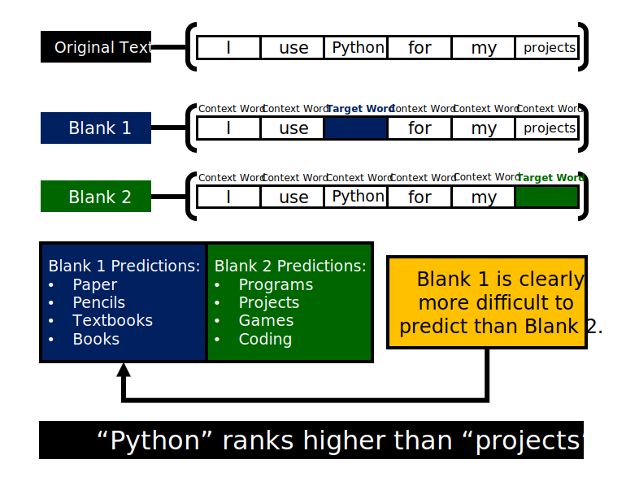
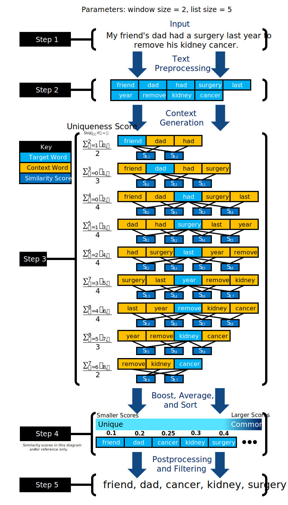
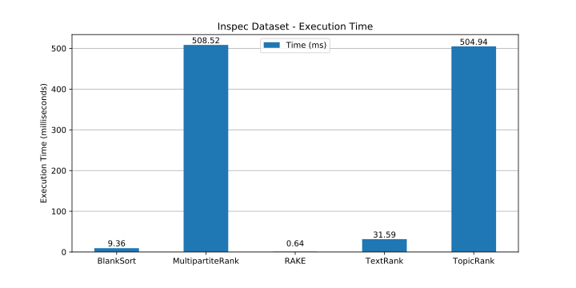

# BlankSort
A Novel Unsupervised Approach to Keyword Extraction

## Sections
1. [Proposal](#proposal)
1. [Definitions](#definitions)
1. [Inspiration and Approach](#inspiration-and-approach)
1. [Algorithm](#algorithm)
1. [Evaluation and Metrics](#evaluation-and-metrics)
1. [Results](#results)
1. [Samples](#samples)
1. [Conclusion and Discussion](#conclusion-and-discussion)
1. [References](#references)

## Proposal

    
View Full Abstract

Keyword extraction is used for tasks such as web searching, article tagging, text categorization, and other text analysis tasks. Keyword extraction algorithms can be categorized into three main types: statistical models, unsupervised and graph models, and supervised models. These three categories of algorithms all have specific strengths and weaknesses – statistical approaches are fast but inaccurate, graph-based and unsupervised approaches provide high accuracy but suffer from poor efficiency and speed, and supervised models have high accuracy but require vast amounts of human labeled data for training. BlankSort proposes a novel unsupervised approach to keyword extraction that merges the speed of statistical models with the accuracy of unsupervised and graph approaches, while not requiring training data unlike supervised learning. BlankSort employs word vectors and contextual weighting of words in close proximity to calculate the “uniqueness score” of each word, resulting in a sorted list of the most important words present in any document. In comparison to popular algorithms such as TextRank, TopicRank, RAKE, and MultipartiteRank, BlankSort displays comparable or state-of-the-art performance on lemmatized versions of the Inspec, DUC, and NUS datasets commonly utilized in model evaluation. Four metrics, namely precision, recall, f-score, and execution time were used to measure the performance of the models, and BlankSort exhibits consistently competitive or higher scores than the state-of-the-art algorithms that exist today.

* Keyword extraction is useful for web searching, article tagging, text categorization, and other text processing tasks.
    * Automatic categorization of online content
    * Extractive summarization of long articles
    * Indexing large databases of text
    * Search engine optimization
* Current approaches can be categorized into three types:
    * Statistical – extremely fast but low accuracy
    * Graphs & Unsupervised Algorithms – high accuracy but poor efficiency and speed
    * Supervised learning – high accuracy and diversity but requires manually labeled datasets for training
* State-of-the-art algorithms:
    * TextRank (Unsupervised Graph)
    * TopicRank (Unsupervised Graph)
    * RAKE (Statistical Model)
    * MultipartiteRank (Unsupervised Graph)
* BlankSort – novel unsupervised approach
    * High efficiency and accuracy
    * Corpus independent, requires no additional data
    * Employs language comprehension for optimal keyword selection
* Results
    * Outperforms state of the art algorithms in most metrics
    * Evaluation datasets:
        * Lemmatized variants of:
            * Inspec (research paper abstracts)
            * DUC (short articles)
            * NUS (full-length research papers)
    * Metrics: precision, recall, f1-score, execution time

## Definitions

| Term              | Definition                         |
|-------------------|------------------------------------|
| Tokens            | An ordered list of filtered words. |
| Target word       | A word that is potentially a keyword. |
| Context           | A set of words that surround a target word that are within a constant number of tokens away. |
| Contexts          | The set of all pairs of target words and their context words. |
| Word vector       | A pre-trained vector representation of a word. |
| Cosine similarity | A function that calculates the similarity of two word vectors. Values are in the range `[-1,1]`, where `-1` is least similar and `1` is most similar. Time complexity is amortized `𝑂(1)`. |
| Similarity score  | The cosine similarity of two words, scaled to the range `[0,1]`.

## Inspiration and Approach

* In most languages including English, text is extremely sparse – the number of keywords is very small in comparison to the total number of words in the document.
* In sparse texts, words that are important in their paragraph and sentence are also important to the entire document.
* When a word is important, it is unique and stands out from the rest. Thus, the goal of the keyword extraction is to find the most unique word in each paragraph or sentence.
* When a word is unique, “blanking” the word and predicting the original word is difficult. This is the fundamental concept behind the BlankSort algorithm.
* By calculating the difficulty of predicting every “blanked out” word, BlankSort can sort the words in the document by their importance.
* General flow of the BlankSort Algorithm:
    1. The input text is pre-processed. Stop words, punctuation marks, and capitalizations are discarded. All words are lemmatized (removing suffixes, tenses, etc.).
    1. After pre-processing, each word in the text is taken as a target word along with its context (±K words around the target, where K is typically 3) to evaluate its uniqueness score.
    1. The uniqueness score is measured based on the average cosine similarity between the word and its context words.
    1. Sorting the words by uniqueness score yields a list of words sorted by their importance.
    1. Keyword candidates are filtered (only nouns and adjectives).
    1. The specified number of keywords are returned.
* `O(N*K)` time complexity (`N` tokens, window size `K`)
    * N factor: Looping over each word
    * K factor: Looping over each context word
    * Similarity evaluation: constant time using cosine similarity
    * Retrieval of FastText word vectors: constant time using a hash table database (1.57GB compressed, 7.70GB raw)

## Algorithm

* Step 1
    * The input document is passed to the algorithm.
* Step 2
    * The text is filtered and tokenized into an array of individual words.
* Step 3
    * The contexts for each target word are generated. Similarity scores are computed for each target word and context word using word vectors.
* Step 4
    * The similarity scores are averaged for each target word, and the words are sorted by their scores in ascending order. Words that appear frequently are given a boost in the rankings, as they are more likely to be keywords.
* Step 5
    * Candidate keywords are filtered (only nouns and adjectives), and the specified number of words with the lowest average similarity scores are selected.

## Evaluation and Metrics
* Word vectors imported from Facebook’s FastText 
* Inspec, DUC, and NUS datasets (lemmatized variants)
    * Inspec: 2000 abstracts from scientific journals
        * Anette Hulth (2003)
    * DUC 2001: 308 medium articles
        * Xiaojun Wan & Jianguo Xiao (2008)
    * NUS: 211 full scientific conference papers
        * Thuy Dung Nguyen & Min-yen Kan (2007)
* Comparison against MultipartiteRank, RAKE, TextRank, TopicRank
* `Precision = (True Positives) / (True Positives + False Positives)`
* `Recall = (True Positives) / (True Positives + False Negatives)`
* `F1 = 2 * (Precision * Recall) / (Precision + Recall)`

## Results

    
View Full Data

### Inspec Dataset

| Algorithm        | Precision                     | Recall | F1    | Time (ms) |
|------------------|-------------------------------|--------|-------|---------- |
| BlankSort        | 0.501                         | 0.484  | 0.492 | 9.359     |
| MultipartiteRank | 0.442                         | 0.39   | 0.414 | 508.516   |
| RAKE             | 0.388                         | 0.321  | 0.351 | 0.641     |
| TextRank         | 0.431                         | 0.337  | 0.378 | 31.586    |
| TopicRank        | 0.429                         | 0.403  | 0.416 | 504.938   |

### DUC Dataset

| Algorithm        | Precision                     | Recall | F1    | Time (ms) |
|------------------|-------------------------------|--------|-------|---------- |
| BlankSort        | 0.39                          | 0.387  | 0.389 | 36.475    |
| MultipartiteRank | 0.383                         | 0.25   | 0.365 | 782.064   |
| RAKE             | 0.116                         | 0.111  | 0.114 | 2.892     |
| TextRank         | 0.325                         | 0.236  | 0.274 | 153.916   |
| TopicRank        | 0.355                         | 0.339  | 0.346 | 704.55    |

### NUS Dataset

| Algorithm        | Precision                     | Recall | F1    | Time (ms) |
|------------------|-------------------------------|--------|-------|---------- |
| BlankSort        | 0.318                         | 0.318  | 0.318 | 286.357   |
| MultipartiteRank | 0.287                         | 0.266  | 0.276 | 7380.03   |
| RAKE             | 0.044                         | 0.038  | 0.041 | 24.924    |
| TextRank         | 0.275                         | 0.195  | 0.228 | 1516.616  |
| TopicRank        | 0.239                         | 0.229  | 0.234 | 5686.509  |

| Dataset  | Performance (higher is better)             | Execution Time (lower is better)    |
| :------: | :----------------------------------------: | :---------------------------------: |
| Inspec   |  |  |
| DUC      |     |     |
| NUS      |     |     |

## Samples
* **Input [Inspec Dataset]:** “Nonlinear extrapolation algorithm for realization of a scalar random process - A method of construction of a nonlinear extrapolation algorithm is proposed. This method makes it possible to take into account any nonlinear random dependences that exist in an investigated process and are described by mixed central moment functions. The method is based on the V. S. Pugachev canonical decomposition apparatus. As an example, the problem of nonlinear extrapolation is solved for a moment function of third order.”

    * **Human Labels:** algorithm, apparatus, canonical, central, decomposition, dependence, error, extrapolation, function, method, mixed, moment, nonlinear, process, random, scalar, square

    * **BlankSort Output:** nonlinear, method, extrapolation, function, moment

* **Input:** “Word embedding is the collective name for a set of language modeling and feature learning techniques in natural language processing (NLP) where words or phrases from the vocabulary are mapped to vectors of real numbers. Conceptually it involves a mathematical embedding from a space with many dimensions per word to a continuous vector space with a much lower dimension.”

    * **BlankSort Output:** word, dimension, vector, space, language

* **Input:** “Python is an interpreted, high-level, general-purpose programming language. Created by Guido van Rossum and first released in 1991, Python's design philosophy emphasizes code readability with its notable use of significant whitespace. Its language constructs and object-oriented approach aim to help programmers write clear, logical code for small and large-scale projects. Python is dynamically typed and garbage-collected. It supports multiple programming paradigms, including procedural, object-oriented, and functional programming. Python is often described as a "batteries included" language due to its comprehensive standard library.”

    * **BlankSort Output:** python, language, programming, code, library

* **Input:** “Data science is a multi-disciplinary field that uses scientific methods, processes, algorithms and systems to extract knowledge and insights from structured and unstructured data. Data science is related to data mining and big data.”

    * **BlankSort Output:** data, science, field, extract, knowledge

## Conclusion and Discussion

### Interpretation of Data
* BlankSort clearly outperforms current state-of-the-art algorithms in single keyword extraction.
* BlankSort performs consistently well across the Inspec, DUC, and NUS datasets.
* BlankSort executes significantly faster than previous approaches (excluding RAKE, which suffers from low performance).

### Future Work
* Implementing multi-word keyphrase extraction by collapsing nearby keywords
* Changing hyperparameters (ex. window size) and optimizing word vectors
* Rewriting code in a compiled language (ex. C/C++) for better performance

## References

1. Rose, Stuart, et al. “Automatic keyword extraction from individual documents.” Text mining: applications and theory 1 (2010): 1-20.
1. Joulin, Armand, et al. “Bag of tricks for efficient text classification.” arXiv preprint arXiv:1607.01759 (2016).
1. Bojanowski, Piotr, et al. “Enriching word vectors with subword information.” Transactions of the Association for Computational Linguistics 5 (2017): 135-146.
1. Hulth, Anette. “Improved automatic keyword extraction given more linguistic knowledge.” Proceedings of the 2003 conference on Empirical methods in natural language processing. Association for Computational  Linguistics, 2003.
1. Nguyen, Thuy Dung, and Min-Yen Kan. “Keyphrase extraction in scientific publications.” International conference on Asian digital libraries. Springer, Berlin, Heidelberg, 2007.
1. Wan, Xiaojun, and Jianguo Xiao. “Single Document Keyphrase Extraction Using Neighborhood Knowledge.” AAAI. Vol. 8. 2008.
1. Mihalcea, Rada, and Paul Tarau. “Textrank: Bringing order into text.” Proceedings of the 2004 conference on empirical methods in natural language processing. 2004.
1. Bougouin, Adrien, Florian Boudin, and Béatrice Daille. “Topicrank: Graph-based topic ranking for keyphrase extraction.” 2013.
1. Boudin, Florian. “Unsupervised keyphrase extraction with multipartite graphs.” arXiv preprint arXiv:1803.08721 (2018).
