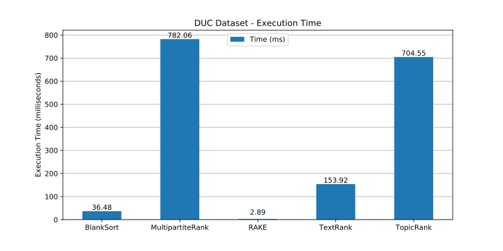
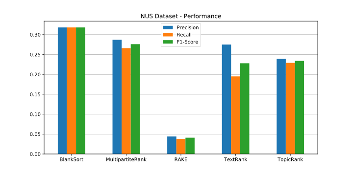

# BlankSort
A Novel Unsupervised Approach to Keyword Extraction

## Sections
1. [Proposal](#Proposal)
1. [Definitions](#Definitions)
1. [Inspiration and Approach](#Inspiration-And-Approach)
1. [Algorithm](#Algorithm)
1. [Evaluation and Metrics](#Evaluation-and-Metrics)
1. [Results](#Results)
1. [Conclusion and Discussion](#Conclusion-and-Discussion)
1. [Package and Source Code](#Package-and-Source-Code)


## Proposal
<details>
    <summary>Full Abstract</summary>

Keyword extraction is used for tasks such as web searching, article tagging, text categorization, and other text analysis tasks. Currently, the most widely used algorithms are statistical models, graph-based models, supervised machine learning models, or unsupervised machine learning models. These four categories of algorithms all have specific strengths and weaknesses – statistical approaches are fast but inaccurate, graph-based approaches provide high accuracy but lack the understanding of language, supervised learning comprehends language but requires vast amounts of human labeled training data, and unsupervised learning does not use manually labeled data but requires a new model to be trained for every new document. BlankSort proposes a novel unsupervised approach to keyword extraction that merges the speed of statistical models, the accuracy of graph-based algorithms, the language comprehension of supervised models, and the label-independent training of unsupervised models. BlankSort employs word vectors and contextual weighting of words in close proximity to calculate the “irrelevancy score” of each word, resulting in a sorted list of the most important words present in any document. In comparison to popular algorithms such as TextRank, TopicRank, RAKE, and MultipartiteRank, BlankSort displays comparable or state-of-the-art performance on lemmatized versions of the Inspec, DUC, and NUS datasets commonly utilized in model evaluation. Four metrics, namely precision, recall, f-score, and execution time were used to measure the performance of the models, and BlankSort exhibits consistently competitive or higher scores than the state-of-the-art algorithms that exist today.

</details>

* Keyword extraction is useful for web searching, article tagging, text categorization, and other text processing tasks.
* Current approaches can be categorized into three types:
    * Statistical – extremely fast but low accuracy
    * Graphs & Unsupervised Algorithms – high accuracy but poor efficiency and speed
    * Supervised learning – high accuracy and diversity but requires manually labeled datasets for training
* State-of-the-art algorithms:
    * TextRank (Unsupervised Graph)
    * TopicRank (Unsupervised Graph)
    * RAKE (Statistical Model)
    * MultipartiteRank (Unsupervised Graph)
* BlankSort – novel unsupervised approach
    * High efficiency and accuracy
    * Corpus independent, requires no additional data
    * Employs language comprehension for optimal keyword selection
* Results
    * Metrics: precision, recall, f1-score, execution time
    * Evaluation datasets:
        * Lemmatized variants of:
            * Inspec (research paper abstracts)
            * DUC (short articles)
            * NUS (full-length research papers)
    * Outperforms state of the art algorithms in most metrics


## Definitions
| Term              | Definition                         |
|-------------------|------------------------------------|
| Tokens            | An ordered list of filtered words. |
| Target word       | A word that is potentially a keyword. |
| Context           | A set of words that surround a target word that are within a constant number of tokens away. |
| Contexts          | The set of all pairs of target words and their contexts. |
| Word vector       | A pre-trained vector representation of a word. |
| Cosine similarity | A function that calculates the similarity of two word vectors. Values are in the range `[-1,1]`, where 1 is the maximum similarity and -1 is the minimum. |


## Inspiration and Approach
* In most languages including English, text is extremely sparse – the number of keywords is very small in comparison to the total number of words in the document.
* In sparse texts, words that are important in their paragraph and sentence are also important to the entire document. 
* When a word is important, it is unique and stands out from the rest. Thus, the goal of the keyword extraction is to find the most unique word in each paragraph or sentence. 
* When a word is unique, "blanking" the word and predicting the original word is difficult. This is the fundamental concept of the BlankSort algorithm.
* By calculating the difficulty of predicting every "blanked out" word, BlankSort can sort the words in the document by their importance.
* General flow of the BlankSort Algorithm:
    1. The input text is pre-processed. Stop words, punctuation marks, and capitalizations are discarded.
    1. After pre-processing, each word in the text is taken as a target word along with its context (`±K` words around the target, where `K` is typically 3) to evaluate its uniqueness score. 
    1. The uniqueness score is measured based on the average cosine similarity between the word and its context words.
    1. Sorting the words by uniqueness score yields a list of words sorted by their importance.


## Algorithm


* Figure 1.1
    * The input document is passed to the algorithm.
* Figure 1.2
	* The text is filtered and tokenized into an array of individual words.
* Figure 1.3
	* The contexts for each target word are generated.
* Figure 1.4
	* Similarity scores are computed for each target word and context word using word vectors.
* Figure 1.5
	* The similarity scores are averaged for each target word, and the words are sorted by their scores in ascending order.
* Figure 1.6
	* The specified number of words with the lowest average similarity scores are selected.


## Evaluation and Metrics
* Lemmatized variants of Inspec, DUC, and NUS datasets
    * Inspec: 2000 abstracts from scientific journals
        * Anette Hulth (2003)
    * DUC 2001: 308 medium articles
        * Xiaojun Wan and Jianguo Xiao (2008)
    * NUS: 211 full scientific conference papers
        * Thuy Dung Nguyen and Min-yen Kan (2007)
    * Comparison against:
        * MultipartiteRank
        * Rapid Automatic Keyword Extraction (RAKE)
        * TextRank
        * TopicRank


## Results


<details>
    <summary>Full Data</summary>

### Inspec Dataset
| Algorithm        | Precision                     | Recall | F1    | Time (ms) |
|------------------|-------------------------------|------- |-------|---------- |
| BlankSort        | 0.501                         | 0.484  | 0.492 | 9.359     |
| MultipartiteRank | 0.442                         | 0.39   | 0.414 | 508.516   |
| RAKE             | 0.388                         | 0.321  | 0.351 | 0.641     |
| TextRank         | 0.431                         | 0.337  | 0.378 | 31.586    |
| TopicRank        | 0.429                         | 0.403  | 0.416 | 504.938   |

### DUC Dataset

| Algorithm        | Precision                     | Recall | F1    | Time (ms) |
|------------------|-------------------------------|------- |-------|---------- |
| BlankSort        | 0.39                          | 0.387  | 0.389 | 36.475    |
| MultipartiteRank | 0.383                         | 0.25   | 0.365 | 782.064   |
| RAKE             | 0.116                         | 0.111  | 0.114 | 2.892     |
| TextRank         | 0.325                         | 0.236  | 0.274 | 153.916   |
| TopicRank        | 0.355                         | 0.339  | 0.346 | 704.55    |

### NUS Dataset

| Algorithm        | Precision                     | Recall | F1    | Time (ms) |
|------------------|-------------------------------|------- |-------|---------- |
| BlankSort        | 0.318                         | 0.318  | 0.318 | 286.357   |
| MultipartiteRank | 0.287                         | 0.266  | 0.276 | 7380.03   |
| RAKE             | 0.044                         | 0.038  | 0.041 | 24.924    |
| TextRank         | 0.275                         | 0.195  | 0.228 | 1516.616  |
| TopicRank        | 0.239                         | 0.229  | 0.234 | 5686.509  |

</details>

| Dataset  | Performance (higher is better)             | Execution Time (lower is better)    |
| :------: | :----------------------------------------: | :---------------------------------: |
| Inspec   |  |  |
| DUC      |     |     |
| NUS      |     |     |

## Conclusion and Discussion

### Interpretation of Data
* BlankSort clearly outperforms current state-of-the-art algorithms in single keyword extraction.
    * BlankSort performs consistently well across the Inspec, DUC, and NUS datasets.
    * BlankSort executes significantly faster than previous approaches (excluding RAKE, which suffers from low performance).

### Future Work
* Implementing multi-word keyphrase extraction by collapsing nearby keywords
* Changing hyperparameters (ex. window size) and optimizing word vectors 
* Rewriting code in a compiled language (ex. C/C++) for better performance

## Package and Source Code

The source code of the BlankSort Python module is available at [KentoNishi/BlankSort](https://github.com/KentoNishi/BlankSort) on GitHub.

The package is hosted on the Python Package Index, so the library can be installed using the following command:

```shell
pip install blanksort
```

Documentation for the BlankSort Python package is available at the repository's [GitHub Wiki Page](https://github.com/KentoNishi/BlankSort/wiki).

Additionaly, all development versions and prototypes of BlankSort can be found at [KentoNishi/BlankSortPrototypes](https://github.com/KentoNishi/BlankSortPrototypes) on GitHub.

## References

```
TODO
```